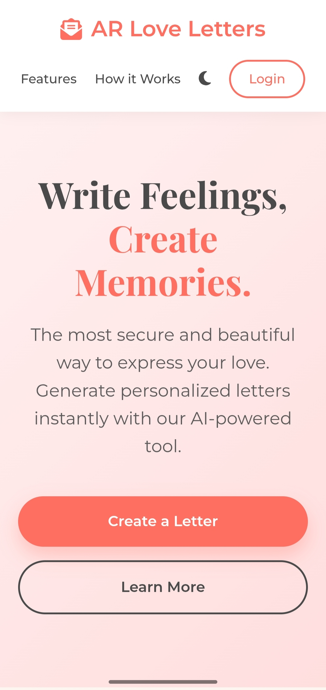
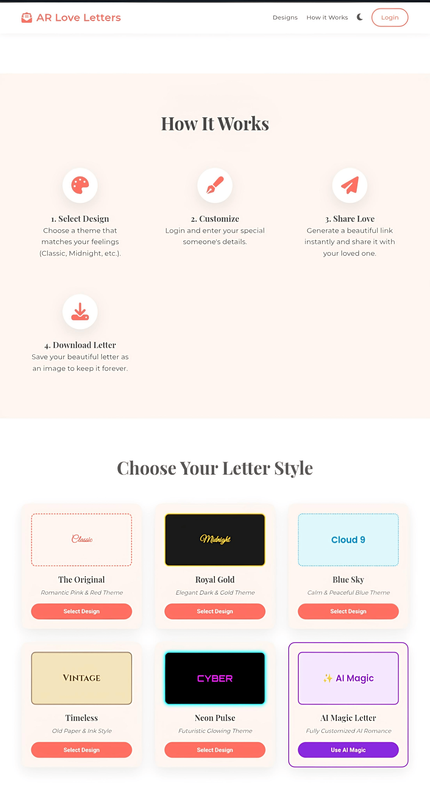
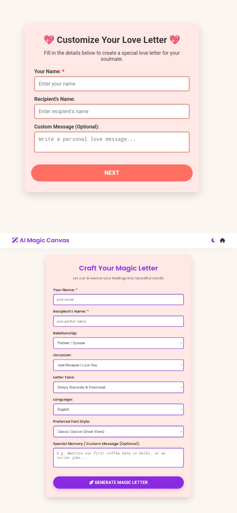
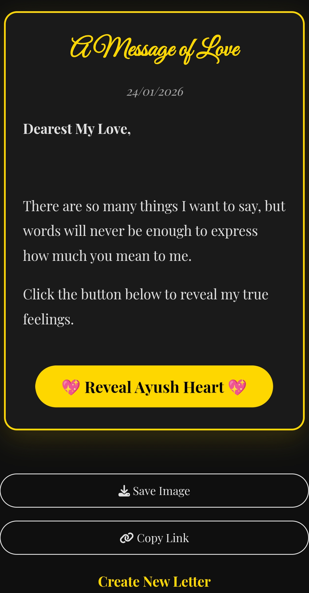

# 💌 AR Love Letters – Advanced Personalized Letter Generator

[](https://opensource.org/licenses/MIT)
[](https://love-letter-service.netlify.app)
[](#)

A secure, interactive, and beautifully designed web application that allows users to generate personalized, heartfelt love letters instantly. Powered by a dual-architecture system, it features 5 handcrafted standard themes and an advanced **AI Magic Canvas** that leverages LLM technology to automatically write and style emotional letters based on minimal user input.

🌐 **Live Demo:** [https://love-letter-service.netlify.app](https://love-letter-service.netlify.app)

---

## ✨ Key Features

### 🎨 The Standard Creator (Stateless & Unlimited)
* **5 Unique Visual Styles:** Choose from Classic Love (Pink), Midnight Romance (Dark/Gold), Blue Sky (Calm), Vintage (Old Paper), and Neon Cyberpunk (Glowing).
* **Dynamic Styling:** The entire application (Background, Fonts, Borders) adapts instantly based on the selected theme.
* **Custom Message Support:** Users can write and personalize their own love letter messages effortlessly.

### 🤖 AI Magic Letters (For Registered Users)
* **LLM-Powered Creation:** Users provide contextual inputs (relationship type, occasion, tone, custom memories), and the AI weaves a deeply personal and grammatically perfect narrative.
* **Multi-Language Support:** Generate letters in dozens of global and regional languages.
* **Auto-Generated Aesthetics:** The system automatically crafts a dynamic color palette and typography that perfectly matches the emotional vibe of the generated text.

### 🔐 Dual-Mode Security & Data Architecture
* **Zero-Storage Guest Mode:** Letters created without logging in are compressed and encrypted directly into the URL payload (`?data=`). **No private text is stored on our servers**, ensuring ultimate privacy.
* **Stateful Cloud Dashboard:** Authenticated users enjoy a secure personal dashboard where their letters (`?id=`) are safely hosted via Google Cloud Firestore, allowing them to manage, revisit, or permanently delete their history.
* **Centralized Support & Security:** Integrated rate-limiting (Anti-Spam) to protect the ecosystem, along with a dedicated Support & Abuse ticketing system for registered users to securely manage their requests.

### 🚀 Smart Sharing & Downloading
* **Theme-Aware Sharing:** When you share a link, the recipient experiences the exact design you crafted (fonts, colors, and theme).
* **Premium Image Export:** Logged-in users and their recipients can download the letter as a high-quality `.png` image that perfectly captures the specific background and style.

---

## 📸 Screenshots

A glimpse into the application interface and workflow.

| **Modern Landing Page** | **User Dashboard & Input** |
| :---: | :---: |
|  |  |
| *Elegant homepage with design selection.* | *Secure area to manage generated letters.* |

| **Recipient Details Form** | **Final Generated Letter** |
| :---: | :---: |
|  |  |
| *Easy-to-use input fields with AI options.* | *Beautiful, shareable final output.* |

---

## 🛠️ Tech Stack

* **Frontend:** HTML5, CSS3 (Advanced CSS Variables), Vanilla JavaScript (ES6 Modules).
* **Backend / Serverless:** Netlify Functions (Node.js).
* **Database & Auth:** Google Firebase (Authentication, Cloud Firestore).
* **AI Integration:** Groq API (Llama 3 Models).
* **Libraries:** * `html2canvas` (For generating downloadable images).
  * `lz-string` (For secure URL payload compression).
  * `FontAwesome` (For UI icons).
* **Hosting:** Netlify.

## 🚀 Getting Started Locally

This repository contains the **Public Landing Page and Legal Documentation** of the AR Love Letters ecosystem. 

*Note: The core AI engine, Firebase authentication, serverless functions, and user dashboards are maintained in a separate, closed-source private repository to ensure maximum security and protect proprietary logic.*

To run this landing page locally:

1. **Clone the repository**
   ```bash
   git clone [https://github.com/ayushraistudio/Love-Letter-Service.git](https://github.com/ayushraistudio/Love-Letter-Service.git)
   cd Love-Letter-Service

2. **Run Locally**
   * No complex setup, `.env` files, or build tools are required for this frontend repo.
   * Simply open `index.html` in any modern web browser or use a VS Code extension like **Live Server**.

---

## 📄 License

Distributed under the MIT License. See the `LICENSE` file for more information.

---

## 👤 Author

**Ayush Rai**

* LinkedIn: [@ayushraistudio](https://in.linkedin.com/in/ayushraistudio)
* GitHub: [@ayushraistudio](https://github.com/ayushraistudio)

---
*Made with ❤️ and code.*
